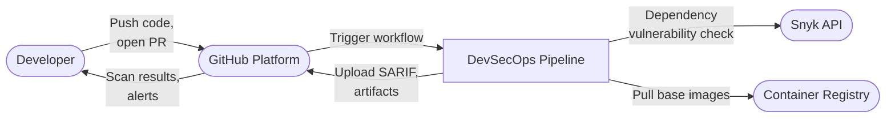
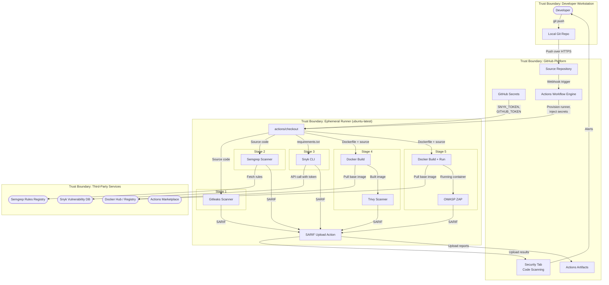

# Data Flow Diagrams: GitHub Actions DevSecOps Pipeline

## Level 0 — Context Diagram

## Level 1 — Pipeline Detail with Trust Boundaries

## Trust Boundaries

| Boundary | Components Inside | Rationale |
|----------|------------------|-----------|
| Developer Workstation | Local git repo, IDE, credentials | Trusted but outside platform control. Compromised workstation can push malicious code or steal credentials. |
| GitHub Platform | Repository, Secrets store, Actions engine, Security tab, Artifacts | Managed SaaS. Trust depends on GitHub's security posture and the org's configuration (branch protections, secret scoping). |
| Ephemeral Runner | Checkout action, all five scanner stages, SARIF upload | Provisioned per-job and destroyed after. Shares the runner image with other GitHub users. Code and third-party actions execute here with access to injected secrets. |
| Third-Party Services | Snyk API, Docker Hub, Semgrep rules registry, Actions Marketplace | External services accessed over HTTPS. Supply chain risk: a compromised action, base image, or rule set can inject malicious code into the pipeline. |

## Critical Data Flows

| # | Flow | Source | Destination | Data | Trust Boundary Crossing |
|---|------|--------|-------------|------|------------------------|
| DF-1 | Code push | Developer workstation | GitHub repository | Source code, Dockerfile, workflow YAML | Dev → GitHub |
| DF-2 | Runner provisioning | GitHub Actions engine | Ephemeral runner | Runner image, environment variables, secrets | GitHub → Runner |
| DF-3 | Code checkout | GitHub repository | Runner filesystem | Full repository contents | GitHub → Runner |
| DF-4 | Dependency check | Snyk CLI on runner | Snyk API | requirements.txt contents, SNYK_TOKEN | Runner → External |
| DF-5 | Base image pull | Docker daemon on runner | Docker Hub | Container base image layers | External → Runner |
| DF-6 | Rule fetch | Semgrep on runner | Semgrep registry | Scanning rule definitions | External → Runner |
| DF-7 | SARIF upload | Scanner stages on runner | GitHub Security tab | Scan results (file paths, line numbers, findings) | Runner → GitHub |
| DF-8 | Artifact upload | Scanner stages on runner | GitHub Artifacts | Full scan reports (HTML, JSON) | Runner → GitHub |
| DF-9 | Action resolution | Workflow YAML | Actions Marketplace / repos | Third-party action code | External → Runner |
