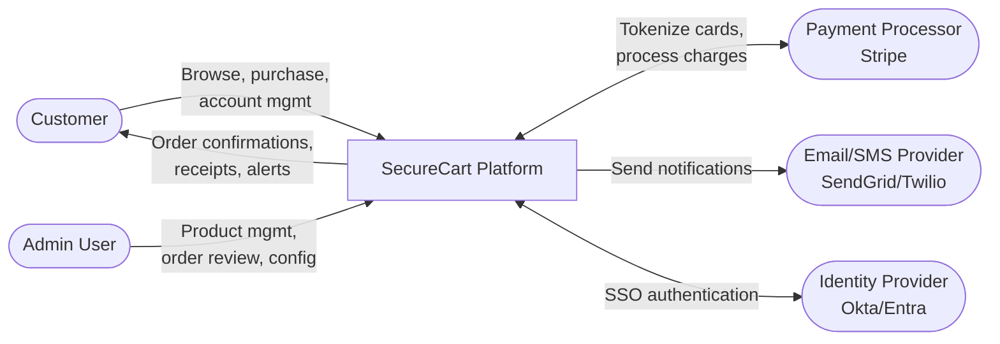
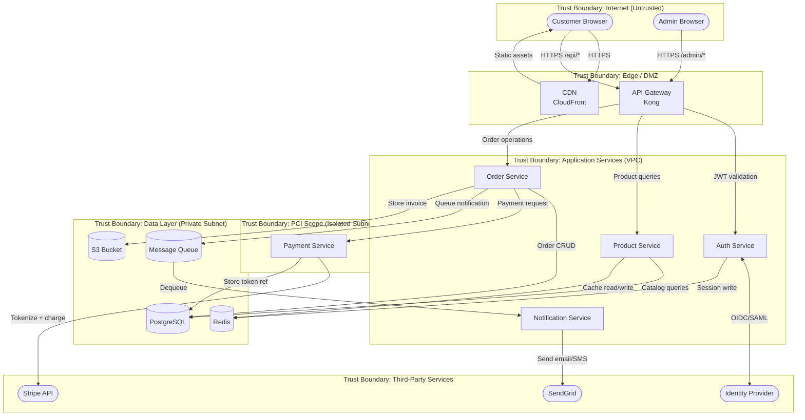

# Data Flow Diagrams: SecureCart E-Commerce Platform

## Level 0 — Context Diagram

## Level 1 — Service Diagram with Trust Boundaries

## Trust Boundaries

| Boundary | Components Inside | Rationale |
|----------|------------------|-----------|
| Internet | Customer browsers, admin browsers | Fully untrusted. All input requires validation. |
| Edge / DMZ | CDN, API Gateway | First layer of defense. TLS termination, rate limiting, request filtering. |
| Application Services | Auth, Product, Order, Notification services | Internal services communicating over private network. Trusted but authenticated. |
| PCI Scope | Payment Service | Isolated subnet with restricted network ACLs. Only the Order Service can reach it. Subject to PCI DSS controls. |
| Data Layer | PostgreSQL, Redis, S3, Message Queue | No direct internet access. Accessible only from Application and PCI subnets. |
| Third-Party | Stripe, SendGrid, IdP | External services accessed over TLS. Require API key management and response validation. |

## Critical Data Flows

| # | Flow | Source | Destination | Data | Trust Boundary Crossing |
|---|------|--------|-------------|------|------------------------|
| DF-1 | Customer login | Browser | Auth Service | Credentials or OIDC token | Internet → Edge → App |
| DF-2 | Product search | Browser | Product Service | Search query | Internet → Edge → App |
| DF-3 | Place order | Browser | Order Service | Cart contents, shipping address | Internet → Edge → App |
| DF-4 | Payment request | Order Service | Payment Service | Order total, customer token ref | App → PCI |
| DF-5 | Card tokenization | Payment Service | Stripe | Card details (ephemeral) | PCI → External |
| DF-6 | Order notification | Queue | Notification Service | Order details, customer email | Data → App |
| DF-7 | Admin product update | Admin browser | Product Service | Product data, images | Internet → Edge → App |
| DF-8 | Invoice storage | Order Service | S3 | PDF invoice with PII | App → Data |
| DF-9 | Session lookup | API Gateway | Redis | JWT / session ID | Edge → Data |
