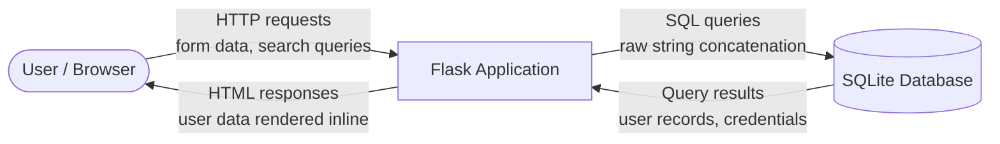
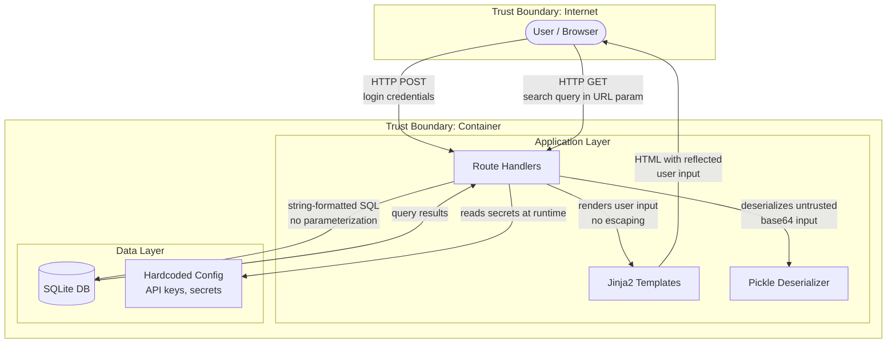

# Data Flow Diagram: Flask Demo Application

## Level 0 — Context Diagram

## Level 1 — Component Diagram with Trust Boundaries

## Trust Boundaries

| Boundary | What It Separates | Key Concern |
|----------|------------------|-------------|
| Internet / Container | Untrusted user input enters the application | All input crosses this boundary unsanitized |
| Application / Data Layer | App logic accesses stored data and secrets | SQL queries built from raw user input; secrets readable in source |

## Data Flows Crossing Trust Boundaries

| # | Flow | Source | Destination | Data | Concern |
|---|------|--------|-------------|------|---------|
| DF-1 | Login request | Browser | Route handler | Username + plaintext password | No TLS enforcement, credentials in cleartext |
| DF-2 | Search query | Browser | Route handler | Arbitrary user string | Passed directly into SQL and HTML |
| DF-3 | HTML response | Template engine | Browser | User data including reflected input | XSS payload delivered to victim |
| DF-4 | SQL query | Route handler | SQLite | String-concatenated query | Injection point |
| DF-5 | Deserialization input | Browser | Pickle handler | Base64-encoded serialized object | Arbitrary code execution |
