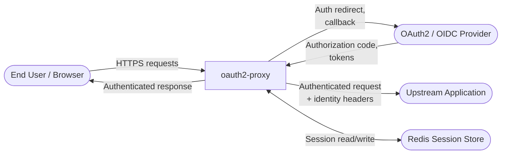
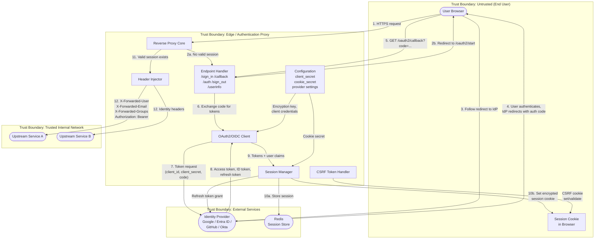

# Data Flow Diagrams: oauth2-proxy

## Level 0 — Context Diagram

## Level 1 — Detailed Flow with Trust Boundaries

## Trust Boundaries

| Boundary | What's Inside | Why It's a Boundary |
|----------|--------------|-------------------|
| Untrusted (End User) | Browser, session cookie | You control nothing here. Cookie can be stolen, browser can be compromised. |
| Edge (Auth Proxy) | Proxy core, OAuth client, session manager, header injector, config | This is the gate. It's internet-facing and makes the auth decision for everything behind it. If it's misconfigured, auth is bypassed for all upstreams. |
| Trusted Internal | Upstream apps | These trust the identity headers blindly. They have no way to verify them on their own. |
| External Services | Identity provider (Google, Okta, etc.), Redis | Outside your control. If the IdP is compromised, your auth is compromised. If Redis is breached, all sessions are exposed. |

## Critical Data Flows

| # | What Happens | What Data Moves | Boundary Crossing |
|---|-------------|----------------|-------------------|
| DF-1 | User sends a request | HTTP request + session cookie | Untrusted → Edge |
| DF-2 | Proxy redirects to login | Redirect URL with state/nonce | Edge → Untrusted |
| DF-3 | User logs in at the IdP | User's credentials (handled by IdP) | Untrusted → External |
| DF-4 | IdP sends auth code back | Authorization code via browser redirect | External → Untrusted → Edge |
| DF-5 | Proxy exchanges code for tokens | Client ID, client secret, auth code | Edge → External |
| DF-6 | IdP returns tokens | Access token, ID token, refresh token | External → Edge |
| DF-7 | Proxy stores session in Redis | Session data with tokens and user claims | Edge → External |
| DF-8 | Proxy sets session cookie | Encrypted cookie with session data | Edge → Untrusted |
| DF-9 | Proxy forwards to upstream with headers | X-Forwarded-User, Email, Groups, Authorization | Edge → Internal |
| DF-10 | Proxy refreshes expired tokens | Refresh token | Edge → External |
| DF-11 | /userinfo returns user email | Email address as JSON | Edge → Untrusted |
| DF-12 | Sign-out with redirect | Redirect URL via `rd` parameter | Edge → Untrusted |
