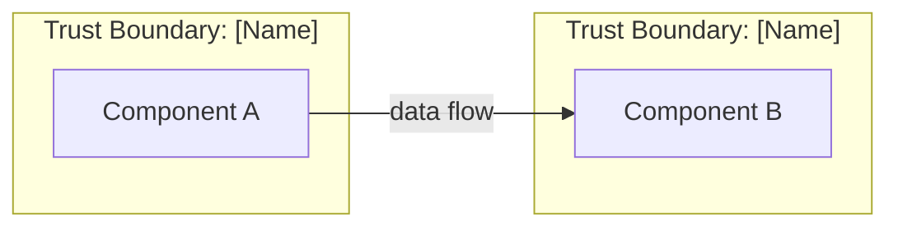

# Threat Model: [System Name]

**Author:** [Name]
**Date:** [Date]
**Version:** 1.0
**Status:** Draft | In Review | Approved

---

## 1. System Overview

### Purpose
[What does this system do? Who uses it?]

### Components
| Component | Technology | Description |
|-----------|-----------|-------------|
| | | |

### Data Classification
| Data Type | Classification | Storage Location |
|-----------|---------------|-----------------|
| | | |

---

## 2. Architecture

### Data Flow Diagram

### Trust Boundaries
| Boundary | Components Inside | Rationale |
|----------|------------------|-----------|
| | | |

---

## 3. STRIDE Analysis

### Spoofing
| # | Component | Threat | Risk | Mitigation |
|---|-----------|--------|------|------------|
| S-1 | | | | |

### Tampering
| # | Component | Threat | Risk | Mitigation |
|---|-----------|--------|------|------------|
| T-1 | | | | |

### Repudiation
| # | Component | Threat | Risk | Mitigation |
|---|-----------|--------|------|------------|
| R-1 | | | | |

### Information Disclosure
| # | Component | Threat | Risk | Mitigation |
|---|-----------|--------|------|------------|
| I-1 | | | | |

### Denial of Service
| # | Component | Threat | Risk | Mitigation |
|---|-----------|--------|------|------------|
| D-1 | | | | |

### Elevation of Privilege
| # | Component | Threat | Risk | Mitigation |
|---|-----------|--------|------|------------|
| E-1 | | | | |

---

## 4. Risk Summary

| Risk Level | Count | Examples |
|-----------|-------|---------|
| Critical | | |
| High | | |
| Medium | | |
| Low | | |

---

## 5. Recommended Mitigations (Priority Order)

1. [Highest priority mitigation]
2. [Next priority]
3. [...]

---

## 6. Assumptions and Out of Scope

### Assumptions
- [List assumptions made during this analysis]

### Out of Scope
- [What was explicitly excluded and why]

---

## Revision History

| Version | Date | Author | Changes |
|---------|------|--------|---------|
| 1.0 | | | Initial threat model |
